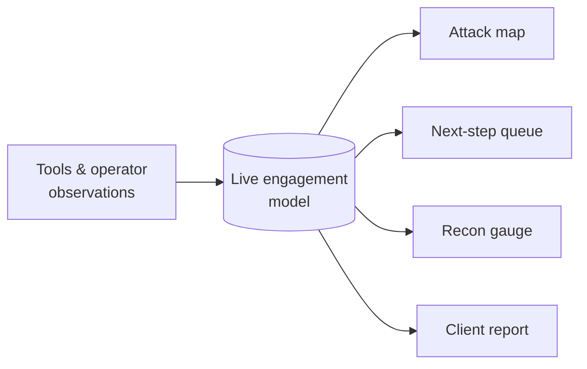
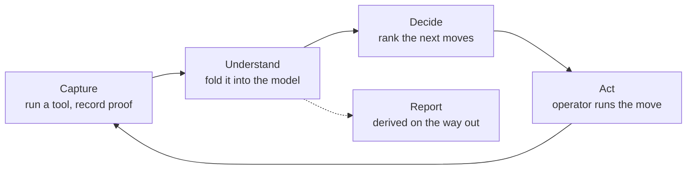
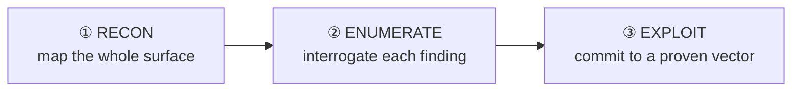

# 🧠 Inside the Engine

**How StrikeOps turns evidence into the next right move.**

Most testing tools are either a scanner or a note-taker. StrikeOps is neither.
At its core is an engine that keeps a **single live model of the engagement** and
uses it to drive the work forward — ranking what to do next, pre-filling it for the
exact target, and refusing to let anything run outside scope.

This page describes how that engine *thinks*, at a design level. It does not
disclose how the tool is built.

---

## One model of the engagement

Every tool result and every operator observation feeds **one running picture** of
the target: the open services, the web surface, the findings and their severity,
the credentials recovered, the footholds gained, the flags captured.

That single model is the source of truth. Everything you look at — the attack map,
the next-step queue, the recon gauge, the final report — is a **view of the same
model**, not a separate copy. They can never drift out of sync, because there is
only one set of facts underneath them.

---

## The loop

StrikeOps runs a disciplined cycle — the same **observe → orient → decide → act**
loop a good operator runs in their head, made explicit and repeatable:

Each action changes the model, so the next set of recommended moves is always
computed from **everything known so far** — not a fixed checklist. Capture a new
finding and the queue re-ranks itself around it.

---

## The decision engine

The engine reads the live model and proposes a ranked list of **concrete next
moves**. Each one is:

- **Pre-filled for the real target** — the command is ready to run, not a
  placeholder you have to hand-edit.
- **Checked against scope before it is offered** — an action outside the authorized
  targets or intensity is shown as blocked, with the reason, never as something you
  can fire by accident.
- **Tied to a finding** — every move traces back to the evidence that motivated it,
  so you always know *why* it's being suggested.

The result is a queue that points at the path that actually matters for *this*
target, while the full methodology stays one click away.

---

## Phase discipline: breadth before depth

The engine is **phase-aware**. Moves are grouped and ordered by where they belong
in the engagement — and the order is deliberate:

The principle is **breadth before depth**: map the entire attack surface before
committing to one vector, so you never tunnel into a hard exploit while an easier
path sits unexamined. Enumeration always leads exploitation — with one exception:
a **confirmed, high-value finding** (a proven injection, a privilege-escalation
path with a foothold already in hand) is promoted to the top so a sure thing is
never buried under routine enumeration.

A **recon-completeness gauge** backs this up. It scores whether the surface is
genuinely mapped — full port coverage, every service enumerated, the web content
discovered — and shows, at a glance, whether you're actually ready to go deep or
just think you are.

---

## Scope as a hard gate

Authorization is not a reminder in StrikeOps — it is enforced.

- Every action is checked against the engagement's **authorized targets, intensity,
  and time window** *before* it can run, and the check **fails closed**: no explicit
  authorization means no action.
- Crossing into a more intrusive class of activity is a **deliberate, recorded
  decision**, bound to the engagement's authorization reference.
- Every run, every scope change, and every assisted action is written to a
  **tamper-evident log**, so the record can prove that all activity fell inside the
  authorized scope.

> Scope is the difference between a pentester and a defendant.

---

## Evidence and provenance

Because the model is only as trustworthy as what feeds it, the engine is strict
about evidence:

- **Raw output is retained** for every run — the proof behind each finding is one
  click away, not lost to terminal scrollback.
- **Findings stay traceable** to exactly where they were observed.
- **Cross-tool duplicates are merged into one finding** without losing which tools
  saw it — real engagements run overlapping tools, and the record reflects that
  cleanly instead of double-counting.
- **Negative results are first-class.** A ruled-out vulnerability or a failed check
  is recorded too, so the engine never loops back on a dead end.

---

## Why it matters

Professional testing lives or dies on **discipline and evidence**. The engine makes
both the path of least resistance: the methodology runs itself, the proof is
captured as you go, the next move is always the informed one, and the report falls
out of the same model you built the whole way through.

---

  <em>Part of the <a href="../README.md">StrikeOps</a> project showcase ·
  source kept private.</em>

